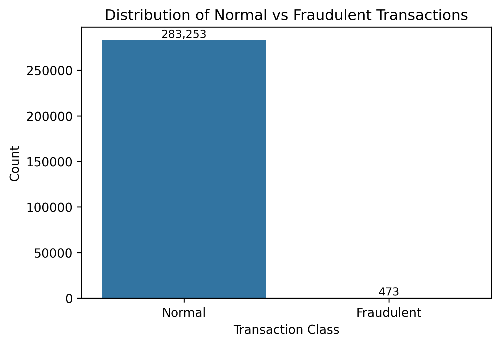
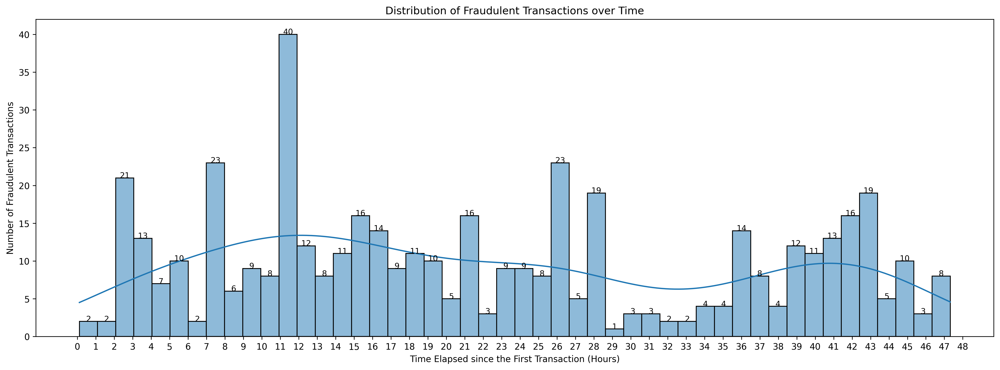
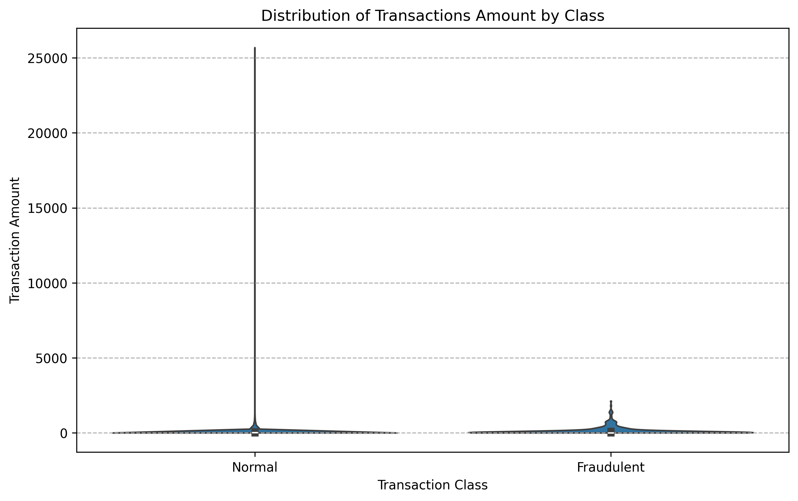

# Credit Card Fraud Detection 

## 🚀 Project Overview 
An advanced fraud detection system evaluating 7+ ML models and 3 sampling techniques on highly imbalanced transaction data (284K+ transactions).

## 🛠️ Technical Implementation
### Data Preparation
- **Dataset**: [Kaggle Credit Card Fraud](https://www.kaggle.com/datasets/mlg-ulb/creditcardfraud)
  - 284,807 transactions (492 frauds → 0.17% imbalance)
  - 30 features (PCA-transformed for privacy)
- **Cleaning**: Removed duplicates (1,081 records)

## 🔍Data Visualization Insights 
| Insight | Visualization | Notes |
|---------|--------------|------------------|
| Extreme class imbalance (0.17% fraud) |  | Justified sampling techniques |
| Fraud peaks 11h after initial transaction |  | Recommend heightened monitoring during this window |
| Fraud amounts consistently under 5000 |  | Flag mid-size transactions for review |

## 🏆 Best Performing Models (RUS)
| Model               | Precision | Recall | F1-Score | AUC  | Speed        |
|---------------------|-----------|--------|----------|------|-----------   |
| Logistic Regression | 0.96      | 0.92   | 0.94     | 0.99 | Fastest  |
| Stacked Ensemble    | 0.99      | 0.90   | 0.94     | 0.98 | Slowest  |

## 🔍 Key Model Insights
- **Optimal Sampling**: Random Undersampling (RUS) prevented overfitting observed in SMOTE (Synthetic Minority Oversampling) / Random Oversampling (ROS)
- **Optimal Threshold**: 0.85 probability balances recall (92%) and precision (96%)

## 💡 Recommendation
1. **Choose Logistic Regression if**:
- You prioritize recall (catching more fraud), need fast real-time systems and value model interpretability
2. **Choose Stacked Ensemble if**:
- You prioritize precision (fewer false alarms), can tolerate slower prediction speed and want slightly better robustness
  
## 💡 Business Impact
- Identified optimal tradeoff between fraud detection (recall) and false alarms (precision)
- Demonstrated Random Undersampling superiority in real-world imbalance scenarios
- Provided actionable threshold recommendations for financial institutions

## 🚀 How to Use
- Clone repository
- Install requirements: pip install -r requirements.txt
- Run Jupyter notebook

## 📌 Note: For dataset access, visit the Kaggle source page
